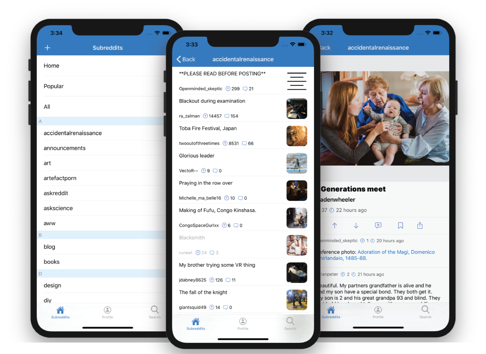

<h1 align="center">
   
  Reaadit for Reddit 
  
</h1>

   

 

A Reddit Client Written in Swift by Kevin Liu

 
 

## Introduction
Reaadit is a Reddit client that is fast, minimalistic, and written completely in Swift 5. I enhanced my skills with REST APIs and JSON parsing by getting familiar with Reddit's API. I also implemented Reddit's OAuth 2 Security with an ASWebAuthenticationSession to log in the User and securely gain access to their account information. After security access, the app is able to access all sorts of functionality; API integration, security, refresh tokens, dynamic information processing, up/down voting, user subreddit sub information, youtube integration, and URL image processing.

## Skills/Resources
- Git
- X Code 11
- REST API and JSON Integration (JSON Decoder)
- Swift
- iOS 12, 13
- OAuth 2.0 Security
- SDWebImage for image processing
- Markdown parsing
- Dynamic TableView Cells that adjust for different types of Reddit Posts Youtube Integration
- UserDefaults

## Modules/Dependencies
- YoutubePlayer-in-WKWebView
- JustHTTP
- SDWebImage

## Steps to compile
To compile Reaadit, follow the steps:
1. Clone the repo, including the modules 
2. open Reddit Client.xcworkspace in Xcode
3. Run the app

